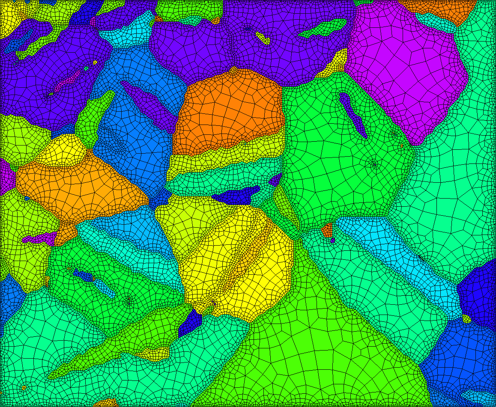

## Purpose of this toolbox
In order to evaluate the thermo-mechanical behaviour of crystalline materials (such as metals or ceramics) at microscopic scale, one usually perform numerical simulation at grain scale using the Finite Element Method. In order to proceed, one must first create a mesh which is representative of the real material.

The microstructure of crystalline materials is usually made from Electron Backscattered Diffraction (EBSD) technique. Thus, this toolbox is designed to generate meshes from EBSD in a robust and accurate way.

## Examples
[](./Examples/aachen.png)
[``aachen.m``](Examples/aachen.m)


[](./Examples/titanium_medium.png)
[``titanium_medium.m``](Examples/titanium_medium.m)

[](./Examples/twins.png)
[``twins.m``](Examples/twins.m)

## Documentation
### Online
You can navigate the documentation [here](html/index.html).

### From MATLAB
#### Full documentation
Once the toolbox is installed on your Matlab session, open the documentation of the present toolbox by typing:

    doc
    
Then, click on "MTEX2Gmsh toolbox", under the _Supplemental Software_ section (bottom right).

#### Help functions
The ``gmshGeo`` class is the core of this toolbox. For comprehensive details about it, just type

    help gmshGeo
    
The following command will print all the ``GmshGeo`` methods:

    methods gmshGeo
    
For details about a given method (let say ``plot``):

    help gmshGeo/plot

## Reference
For further details, check out the corresponding paper [[1]](#1). If you use this project, please cite it as follows:

````
@article{MTEX2Gmsh,
  doi = {10.21105/joss.02094},
  url = {https://doi.org/10.21105/joss.02094},
  year = {2020},
  publisher = {The Open Journal},
  volume = {5},
  number = {52},
  pages = {2094},
  author = {Dorian Depriester and R\'egis Kubler},
  title = {MTEX2Gmsh: a tool for generating 2D meshes from EBSD data},
  journal = {Journal of Open Source Software}
}
````

<a id="1">[1]</a> Depriester et al., (2020). MTEX2Gmsh: a tool for generating 2D meshes from EBSD data. *Journal of Open Source Software*, 5(52), 2094, https://doi.org/10.21105/joss.02094
